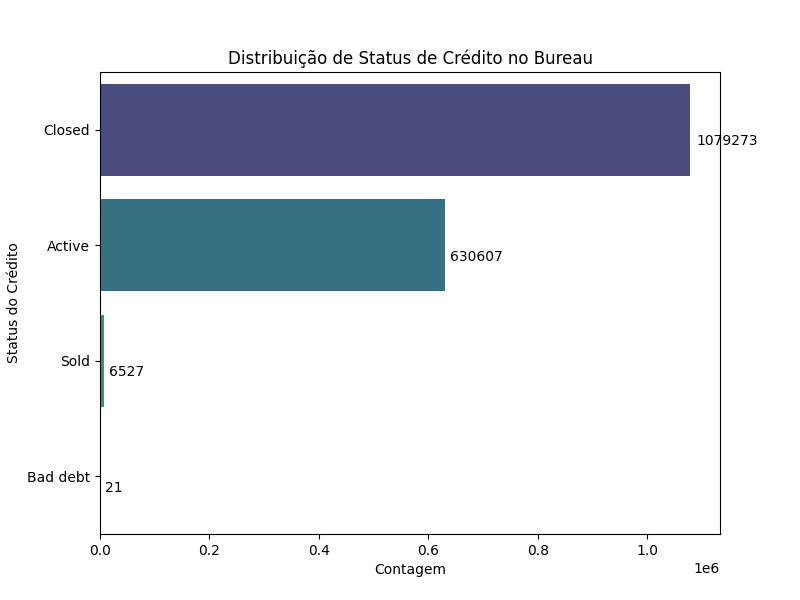
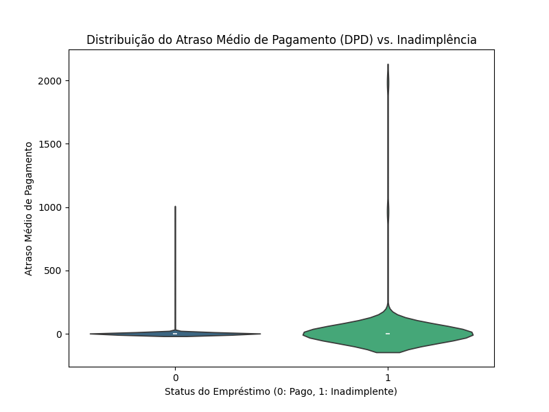

# Engenharia de Features de Dados Relacionais

Com o dataset principal (`application_train.csv`) limpo e pré-processado, a etapa seguinte foi o enriquecimento de dados. A engenharia de features a partir de dados relacionais é um dos pilares deste projeto, demonstrando a capacidade de trabalhar com múltiplas fontes de dados de forma estratégica. O objetivo foi agregar informações das tabelas secundárias para criar novas colunas que resumem o histórico de cada cliente e que servem como preditores poderosos para o nosso modelo.

## Estrutura do Banco de Dados

Os dados foram fornecidos em um formato relacional, com diversas tabelas interligadas por chaves primárias e estrangeiras. A compreensão dessa estrutura foi crucial para planejar a agregação de dados.

O esquema de relacionamento pode ser visualizado da seguinte forma:

**df_application_train**  
*(Tabela principal)*  
→ Chave Primária: `SK_ID_CURR`

├── **df_bureau**  
    → Chave Primária: `SK_ID_BUREAU`  
    → Chave Estrangeira: `SK_ID_CURR` (link com `df_application_train`)  
    │  
    └── **df_bureau_balance**  
        → Chave Estrangeira: `SK_ID_BUREAU` (link com `df_bureau`)
 

(Gráfico da distribuição do status do crédito em Fechado, ativo e vendido)

 

(Gráfico de violino do atraso médio entre as adimplências)

├── **df_previous_application**  
    → Chave Primária: `SK_ID_PREV`  
    → Chave Estrangeira: `SK_ID_CURR` (link com `df_application_train`)  
    │  
    ├── **df_pos_cash**  
    │   → Chave Estrangeira: `SK_ID_PREV` (link com `df_previous_application`)  
    │  
    ├── **df_installments_payments**  
    │   → Chave Estrangeira: `SK_ID_PREV` (link com `df_previous_application`)  
    │  
    └── **df_credit_card_balance**  
        → Chave Estrangeira: `SK_ID_PREV` (link com `df_previous_application`)

* `SK_ID_CURR`: Identificador único de cada cliente. Usado para ligar todas as tabelas ao DataFrame principal (`application_train`).
* `SK_ID_PREV`: Identificador único de cada pedido de empréstimo anterior. Usado para ligar `previous_application` e suas tabelas dependentes ao `df_application_train`.
* `SK_ID_BUREAU`: Identificador único de cada crédito anterior em outras instituições. Usado para ligar `bureau` e `bureau_balance`.

### Detalhamento das Features Criadas

Para cada tabela relacional, foram criadas novas features através de agregações (`mean`, `sum`, `count`, etc.) agrupadas por cliente (`SK_ID_CURR`). As colunas originais categóricas foram transformadas com One-Hot Encoding antes da agregação.

##### Histórico de Crédito em Outras Instituições (Tabelas `bureau` e `bureau_balance`)

* **Descrição das Tabelas:** `bureau` lista os créditos que o cliente tinha em outras instituições. `bureau_balance` fornece o histórico mensal desses créditos.
* **Features Criadas:**
    * `bureau_DAYS_CREDIT_MEAN`, `bureau_AMT_CREDIT_SUM_MEAN`, etc.: Médias dos dias de crédito e valores de crédito, resumindo o histórico geral do cliente.
    * `bureau_balance_STATUS_..._MEAN`: Proporção de meses em que o cliente teve um determinado status de pagamento (ex: `STATUS_1` para atraso de 1-30 dias).
    * `CREDIT_ACTIVE_...`, `CREDIT_CURRENCY_...`: Proporções de créditos com um status de atividade ou moeda específica.

##### Histórico de Pedidos de Empréstimo Anteriores (Tabela `previous_application`)

* **Descrição da Tabela:** Contém o histórico de pedidos de empréstimo do cliente com a própria Home Credit.
* **Features Criadas:**
    * `prev_SK_ID_PREV_COUNT`: Número total de pedidos anteriores.
    * `prev_AMT_CREDIT_MEAN`: Valor médio dos créditos solicitados em pedidos anteriores.
    * `prev_DAYS_DECISION_MEAN`: Média de dias desde a decisão dos pedidos anteriores (indicando a recência do histórico).
    * `prev_NAME_CONTRACT_STATUS_..._MEAN`: Proporções de pedidos que foram aprovados, negados, cancelados, etc.
    * `prev_PRODUCT_COMBINATION_..._MEAN`: Proporções de pedidos com um tipo de produto específico.
    * `prev_CHANNEL_TYPE_..._MEAN`: Proporções de pedidos feitos por um canal de venda específico.

##### Histórico de Pagamentos de Parcelas (Tabela `installments_payments`)

* **Descrição da Tabela:** Detalhes de cada pagamento de parcela de empréstimos anteriores.
* **Features Criadas:**
    * `installments_SK_ID_PREV_COUNT`: Contagem total de pagamentos de parcelas.
    * `installments_DIFF_INSTALLMENTS_MEAN`: Diferença média entre o valor esperado e o valor pago da parcela. Um valor positivo indica pagamento menor que o esperado.
    * `installments_DIFF_PAYMENT_MEAN`: Diferença média entre a data de vencimento e a data de pagamento. Um valor positivo indica pagamento adiantado, e um valor negativo indica atraso.

##### Histórico de Balanço de Cartão de Crédito (Tabela `credit_card_balance`)

* **Descrição da Tabela:** Histórico mensal de balanço de cartões de crédito.
* **Features Criadas:**
    * `credit_card_SK_DPD_MEAN`: Média de dias de atraso nos pagamentos de cartão de crédito.
    * `credit_card_AMT_BALANCE_MEAN`: Valor médio do balanço do cartão de crédito.
    * `credit_card_NAME_CONTRACT_STATUS_ACTIVE_MEAN`: Proporção de meses em que o contrato do cartão esteve ativo.
