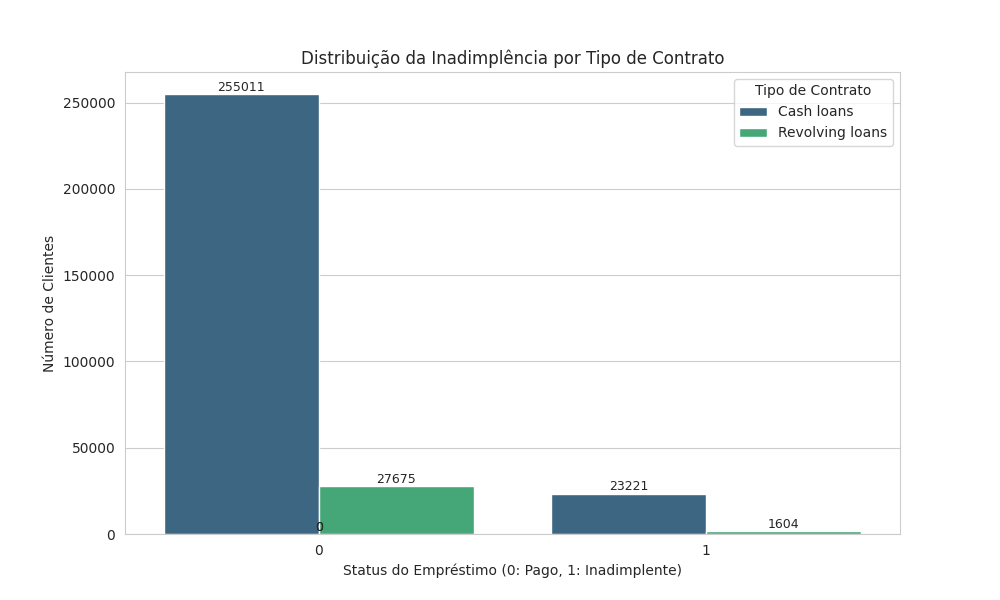

## Objetivos

* Realizar uma Análise Exploratória de Dados (AED) aprofundada para compreender as características dos clientes e os padrões relacionados à inadimplência.
* Tratar e pré-processar um dataset complexo e relacional, simulando dados do mundo real.

## Conjunto de Dados

O projeto utiliza o conjunto de dados **Home Credit Default Risk**, disponível no Kaggle. Este dataset é composto por múltiplas tabelas que simulam um banco de dados relacional, contendo informações sobre:
* Pedidos de empréstimo (`application_train.csv`, `application_test.csv`)
* Histórico de crédito em outras instituições (`bureau.csv`, `bureau_balance.csv`)
* Pedidos de empréstimo anteriores com a Home Credit (`previous_application.csv`)
* Histórico de pagamentos de empréstimos e cartões de crédito (`POS_CASH_balance.csv`, `installments_payments.csv`, `credit_card_balance.csv`)
* Um dicionário de dados detalhado (`HomeCredit_columns_description.csv`)

## Análise Exploratória de Dados (AED) e Pré-Processamento

Esta seção detalha as etapas cruciais de limpeza, transformação e preparação dos dados, demonstrando robustez no tratamento de dados.

### 1. Visão Geral do Dataset Principal (`application_train.csv`)
* **Carregamento e Primeiras Observações:** Iniciamos carregando `application_train.csv` e explorando suas estatísticas descritivas (`.describe()`). Identificamos o volume de dados (aproximadamente 307 mil entradas) e uma visão inicial das distribuições das variáveis numéricas.
* **Distribuição da Variável Target (`TARGET`):** Visualizamos a distribuição da variável alvo, `TARGET`, que indica a inadimplência (1) ou não (0). Confirmamos que o dataset é **altamente desbalanceado**, com aproximadamente 8% de casos de inadimplência, o que é um desafio comum em problemas de risco de crédito e requer atenção especial nas etapas de modelagem e avaliação.
 (Gráfico da distribuição geral da TARGET)

    * **[Imagem: `imagens/target_distribution_by_contract_type.png`]** (Gráfico da distribuição da TARGET por tipo de contrato, mostrando diferenças no risco entre 'Cash loans' e 'Revolving loans').
* **Identificação de Valores Ausentes (Missing Values):** Realizamos uma análise detalhada dos valores ausentes por coluna, calculando tanto a contagem quanto a porcentagem. Notamos a presença significativa de `NaN`s, especialmente em colunas relacionadas a detalhes imobiliários (ex: `COMMONAREA_AVG`, `YEARS_BUILD_AVG`) com até ~70% de dados faltantes, e `OWN_CAR_AGE` com ~66% de `NaN`s.
    * **Observação Crucial:** A presença de valores ausentes em muitas colunas não era aleatória, mas sim **informativa**, como demonstramos em análises posteriores.
* **Análise de Tipos de Dados:** Identificamos os tipos de dados de cada coluna (`int64`, `float64`, `object`), essencial para planejar as etapas de pré-processamento e codificação.

