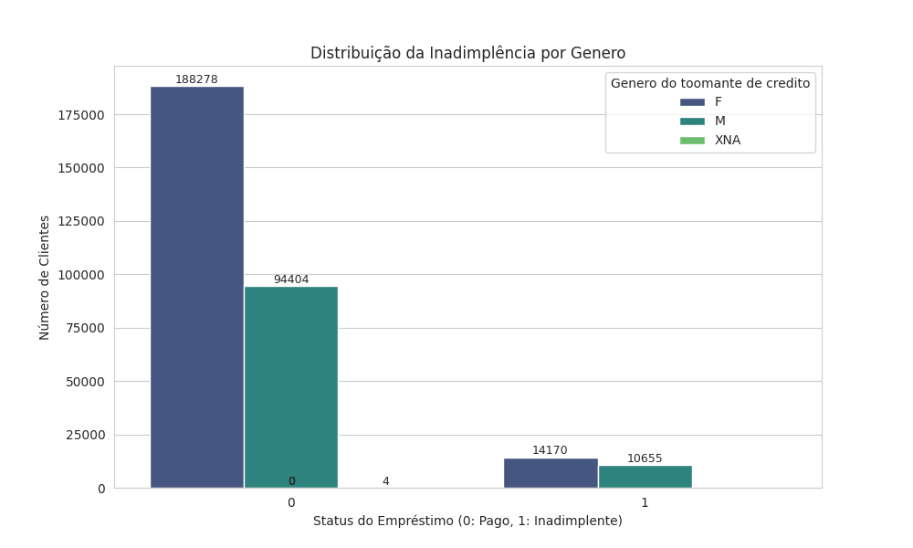
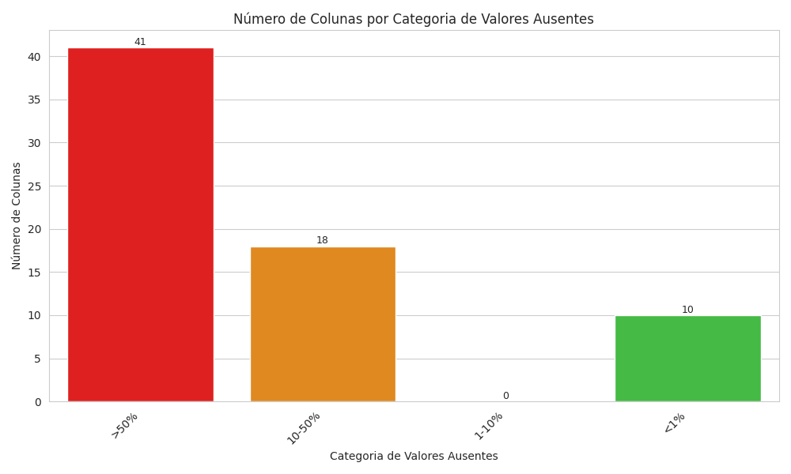
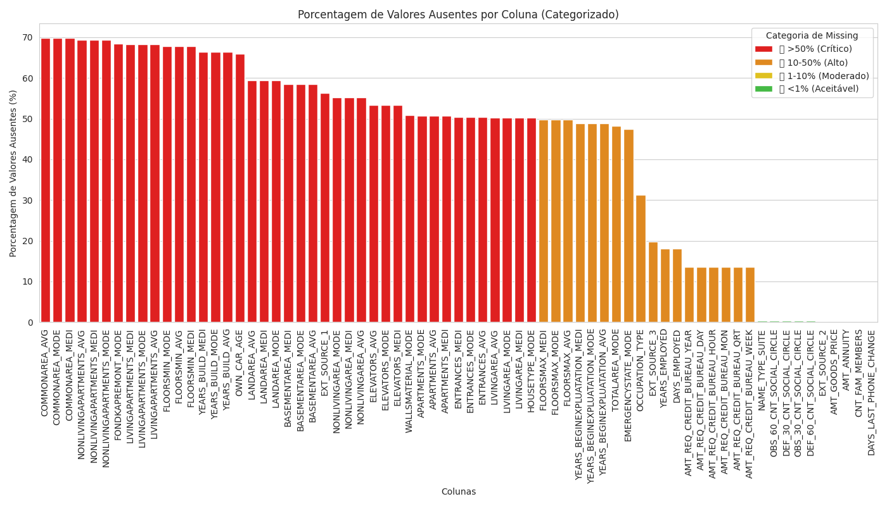

## Objetivos

* Realizar uma Análise Exploratória de Dados (AED) aprofundada para compreender as características dos clientes e os padrões relacionados à inadimplência.
* Tratar e pré-processar um dataset complexo e relacional, simulando dados do mundo real.

## Conjunto de Dados

O projeto utiliza o conjunto de dados **Home Credit Default Risk**, disponível no Kaggle. Este dataset é composto por múltiplas tabelas que simulam um banco de dados relacional, contendo informações sobre:
* Pedidos de empréstimo (`application_train.csv`, `application_test.csv`)
* Histórico de crédito em outras instituições (`bureau.csv`, `bureau_balance.csv`)
* Pedidos de empréstimo anteriores com a Home Credit (`previous_application.csv`)
* Histórico de pagamentos de empréstimos e cartões de crédito (`POS_CASH_balance.csv`, `installments_payments.csv`, `credit_card_balance.csv`)
* Um dicionário de dados detalhado (`HomeCredit_columns_description.csv`)

## Análise Exploratória de Dados (AED) e Pré-Processamento

Esta seção detalha as etapas cruciais de limpeza, transformação e preparação dos dados, demonstrando robustez no tratamento de dados.

### 1. Visão Geral do Dataset Principal (`application_train.csv`)
* **Carregamento e Primeiras Observações:** Iniciamos carregando `application_train.csv` e explorando suas estatísticas descritivas (`.describe()`). Identificamos o volume de dados (aproximadamente 307 mil entradas) e uma visão inicial das distribuições das variáveis numéricas.
* **Distribuição da Variável Target (`TARGET`):** Visualizamos a distribuição da variável alvo, `TARGET`, que indica a inadimplência (1) ou não (0). Confirmamos que o dataset é **altamente desbalanceado**, com aproximadamente 8% de casos de inadimplência, o que é um desafio comum em problemas de risco de crédito e requer atenção especial nas etapas de modelagem e avaliação.
 (Gráfico da distribuição da TARGET por tipo de contrato, mostrando diferenças no risco entre 'Cash loans' e 'Revolving loans')

 (Gráfico da distribuição da TARGET por genero, mostrando que homens são mais tomadores de credito que mulheres mas na proporção de maus pagadores tambem se mantém)

* **Dados Anaomalos:** A coluna `DAYS_EMPLOYED` (dias de emprego) apresentou um valor anômalo de `365243`, representando um período irrealista (quase 1000 anos). Essa anomalia, presente em aproximadamente 18% dos dados, é comumente interpretada como um indicador de desemprego.

|  Estatística   | DAYS_EMPLOYED      |
|---------------|--------------------|
| count         | 307,511.00         |
| mean          | 63,815.05          |
| std           | 141,275.77         |
| min           | -17,912.00         |
| 25%           | -2,760.00          |
| 50% (mediana) | -1,213.00          |
| 75%           | -289.00            |
| max           | **365,243.00**         |

* **Identificação de Valores Ausentes (Missing Values):** O dataset apresenta 69 variáveis com dados ausentes, exibindo uma distribuição heterogênea que varia desde níveis críticos (69,87% de missing values) até valores residuais (0,00033% de registros incompletos).

   **Distribuição de Valores Ausentes por Severidade**  

| Categoria          | Qtd Colunas | % do Total | 
|--------------------|     :---:   |------------|
| 🔴 **Crítico**     | 41          | 59.42%    | 
| 🟠 Alto           | 18          | 26.09%     | 
| 🟡 Moderado       | 0           | 0.00%      | 
| 🟢 Aceitável      | 10          | 14.49%     | 

**Legenda de Severidade:**  
🔴 >50% Missing Values (Crítico) | 🟠 10-50% Missing Values (Alto) | 🟡 1-10% Missing Values (Moderado) | 🟢 <1% Missing Values (Aceitável)

 (Gráfico da distribuição das missing values)

. **Polarização de Dados**  
   - 85% das colunas problemáticas (🔴+🟠) concentram-se em 2 domínios:  
     • Métricas imobiliárias (72%)  
     • Histórico creditício (28%)
     
 (Gráfico da distribuição das colunas e seus missing values)

